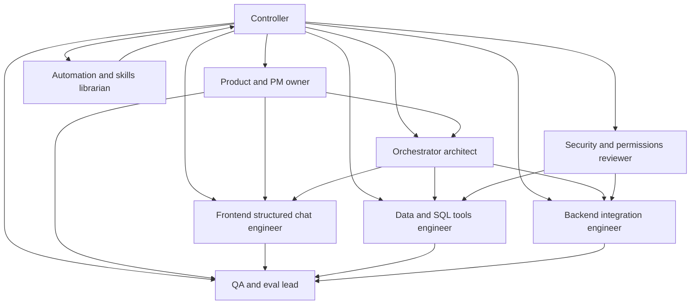

# Meridian Logistics Agent Map

## How To Read This

- `agent-registry.md`, `runbook.md`, `artifact-ledger.md`, and `dispatch-board.md` are operational truth.
- This file is the conceptual map only.

## Baseline Swarm

- `1` controller
- `8` baseline workers
- active cap `4` to `5`

## Peak Burst

- burst to `12` to `14` total only for temporary build or review spikes
- optional OCR utility agent stays outside baseline

## Baseline Role Map

| Agent | Purpose | Primary Output | Depends On |
| --- | --- | --- | --- |
| Controller | Orchestrate only | task routing, synthesis, next action | all reports |
| Product and PM owner | define scope, milestones, backlog | PRD, backlog | source brief |
| Orchestrator architect | design system and flows | architecture overview, interface plan | source brief, PRD |
| Automation and skills librarian | keep worker prompts and startup discipline tight | manifests, task prompts | controller rules |
| Data and SQL tools engineer | define safe read layer | tool schema, data notes | architecture, security |
| Backend integration engineer | define action execution layer | endpoint mapping, gateway plan | architecture, security |
| Frontend structured chat engineer | define and build structured chat surface | response schema, UI plan | PRD, architecture |
| Security and permissions reviewer | define and verify data protections | security model | source brief, architecture |
| QA and eval lead | define and run readiness checks | eval plan, QA matrix | PRD, architecture |

## Mermaid

## Operating Rule

One owner per artifact. One reviewer chain per artifact. Controller never becomes the artifact owner unless no specialist is available.
