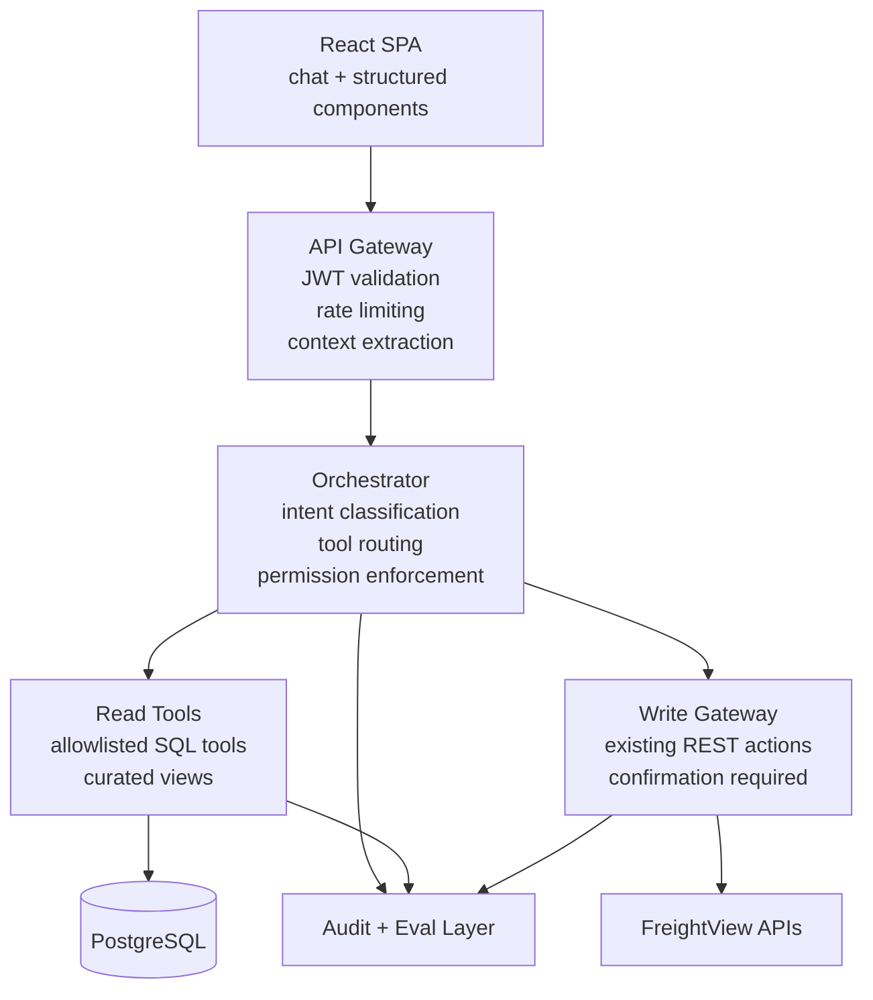
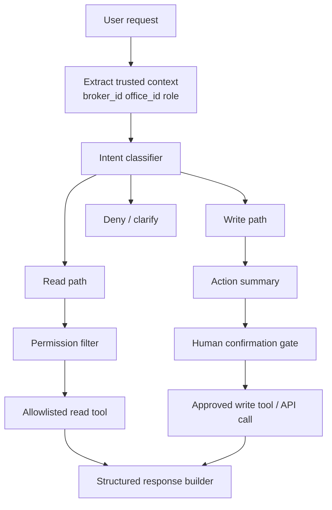
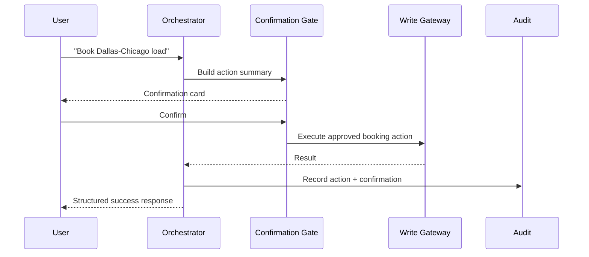
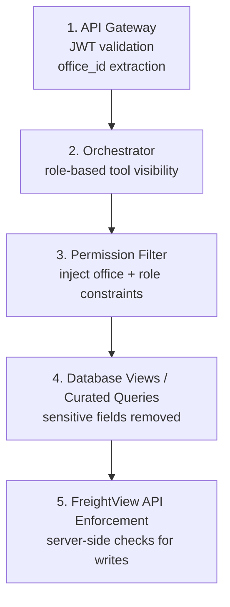
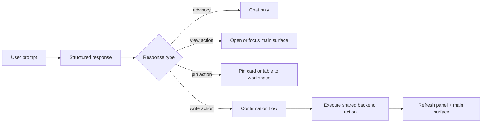

# Meridian Logistics AI Context

Full Markdown + Mermaid reference for AI tools. This keeps the deck-level architecture signal, the case-study operating details, and the engineering deliverable shape in one copy-pasteable doc.

## Source Basis

- `source-brief.md`
- `prd.md`
- `architecture-overview.md`
- `security-model.md`
- `eval-plan.md`
- `meridian-logistics-case-study.txt`

## One-Line Thesis

Replace FreightView's fragmented multi-module workflow with one conversational interface backed by controlled orchestration, allowlisted tools, explicit permission enforcement, and human-confirmed writes.

## Problem

Freight brokers work across six modules that all interrogate the same underlying operational data:

- Quote Engine
- Dispatch Board
- Track & Trace
- Carrier Scorecard
- Billing & Claims
- Analytics

Operational pain:

- Brokers manage 40 to 60 active shipments at once.
- A single shipment workflow can span seven screens.
- The analytics team has a large ad hoc request backlog.
- Early natural-language SQL attempts were unreliable: roughly 62% valid SQL, hallucinated joins, unbounded queries.

## Company Context

- Business: mid-market freight brokerage
- Headquarters: Memphis, Tennessee
- Revenue: $380M
- Employees: 310
- Carriers: 4,200
- Offices: Memphis, Dallas, Atlanta, Chicago, Denver

Current stack:

- Backend: Python / FastAPI
- Frontend: React SPA
- Database: PostgreSQL, 15 tables, 40M+ rows
- Cache / jobs: Redis
- Surface area: monolith with 34 REST endpoints

Growth / ops context:

- 22% year-over-year growth for the last three years
- Half the company are brokers
- Highest-performing brokers still spend about 35% of their day on manual lookup and status updates
- Analytics team: 2 people, roughly 170-request backlog, about 9-day turnaround

## Core Insight

Every FreightView screen is ultimately a constrained query or action over the same office-scoped operational schema.

Therefore:

- Replace screen hopping with conversational intent capture.
- Keep execution safe by routing through pre-approved tools.
- Return structured UI payloads instead of freeform prose for operational work.

## FreightView Modules

| Module | Function | Daily Active Users |
| --- | --- | ---: |
| Quote Engine | Rate lookups across carrier APIs | 142 |
| Dispatch Board | Assign loads to carriers | 138 |
| Track & Trace | Real-time shipment visibility | 204 |
| Carrier Scorecard | Performance ratings, compliance | 46 |
| Billing & Claims | Invoicing, dispute resolution | 61 |
| Analytics | Canned reports, CSV exports | 89 |

## Data Model Snapshot

Core rule:

Every core table carries `office_id`. Sensitive columns must stay hidden from both the UI and the agent.

Primary entities:

- `offices`: 5 rows, office identity and region
- `brokers`: about 155 rows, tied to office and role
- `carriers`: about 4,200 rows, includes status, rating, insurance expiry
- `shippers`: about 1,800 rows, includes sensitive credit limits
- `shipments`: about 2.4M rows, operational core table
- `quotes`: about 8.1M rows, quoted rates and validity windows
- `tracking_events`: about 24M rows, shipment telemetry
- `invoices`: office-scoped financial records

Additional tables called out in source:

- `lanes`
- `carrier_lanes`
- `claims`
- `documents`
- `notifications`
- `audit_log`
- `rate_history`

Sensitive columns explicitly called out:

- `shipments.carrier_rate`
- `shipments.shipper_rate`
- `quotes.rate`
- `shippers.credit_limit`
- invoice amounts and related financial fields

## Lifecycle And Roles

Shipment lifecycle:

- `quoted`
- `booked`
- `in_transit`
- `delivered`
- `cancelled` from any state

Role hierarchy:

- `broker`
- `office_manager`
- `vp`

Permission model:

- broker: assigned records within their office
- office_manager: all records within their office
- vp: all offices

Hard rule:

A broker asking for all shipments must never see another office's data.

## System Layers



## Orchestrator Model

The orchestration layer classifies requests into safe execution paths. Each path has its own tool cluster, permission guardrails, and latency profile.



## Query Pipeline

Key rule:

No query reaches the database without trusted permission context.

Read-path expectations:

- Role and office context come from JWT, not prompt text.
- The model selects from prebuilt tools, not arbitrary SQL.
- Office and role filters apply before execution.
- Result size and query shape stay bounded.
- Output is normalized into tables, metrics, timelines, or cards.

Representative read asks:

- average transit time for LTL Dallas to Chicago over 90 days
- top 5 carriers by on-time rate for FTL loads over 20,000 lbs in the Southeast
- shipments in transit where carrier insurance expires in the next 30 days

## Write Pipeline

Writes stay narrower than reads.

- PoC write scope: single-step booking only
- Human confirmation is mandatory
- The orchestrator pauses before execution and presents a reviewable action summary
- Audit logs capture requester, confirmation, target action, and outcome

Representative write asks:

- book Dallas-Chicago lane with Carrier #4412 at the quoted rate for next Tuesday pickup
- mark shipment #88219 delayed and notify the shipper of a new ETA

PoC handling:

- booking is in scope
- status updates stay deferred unless promoted later



## SQL Strategy

Do not let the model synthesize open-ended SQL.

Preferred pattern:

- Engineers prewrite SQL-backed tools.
- The model picks a tool and supplies validated parameters.
- Query shapes, joins, limits, and permission scopes remain controlled in code.

Example:

```sql
-- Tool: get_avg_transit_time(origin, destination, days_back)
SELECT AVG(transit_days)
FROM shipment_transit_summary
WHERE office_id = $1
  AND origin_city = $2
  AND destination_city = $3
  AND delivered_at >= NOW() - ($4 || ' days')::INTERVAL;
```

Expected outcome:

- high analytics coverage for common requests
- zero hallucinated joins
- bounded, reviewable query behavior

Reference agent-to-database contract:

```json
{
  "sql": "SELECT c.name, COUNT(*) AS loads, AVG(te.delay_mins) ...",
  "params": {
    "broker_id": 42,
    "office_id": 1
  },
  "max_rows": 50,
  "sensitive_columns_excluded": ["carrier_rate", "shipper_rate"],
  "requires_confirmation": false
}
```

Practical guardrails:

- no destructive SQL
- no ad hoc schema exploration
- no unrestricted joins
- no unbounded scans
- explicit row caps
- explicit timeout caps

## Security Model

Defense in depth. No single layer is trusted on its own.



Sensitive data rules:

- Do not expose carrier rates
- Do not expose shipper rates
- Do not expose shipper credit limits
- Deny cross-office access unless role explicitly allows it
- Fail closed on unsupported intents

Prompt-injection posture:

- structured output only where possible
- no raw SQL generation
- no role derivation from prompt text
- explicit allowlists for tools and writes

Failure modes to design around:

- prompt injection asking for hidden columns
- cross-office comparison from under-scoped users
- unauthorized action escalation
- quote expiration between planning and confirmation
- stale resource state at execution time

## Structured Response Contract

The agent returns renderable UI data, not just chat text.

```json
{
  "message": "Top carriers by on-time rate",
  "components": [
    {
      "type": "table",
      "columns": ["Carrier", "On-Time %", "Loads"],
      "rows": [
        ["Swift", "94.2%", 88],
        ["Werner", "91.8%", 62]
      ]
    },
    {
      "type": "action_button",
      "label": "Book carrier",
      "action": "POST /shipments/book",
      "requires_confirmation": true
    }
  ]
}
```

Typical component types:

- table
- metric card
- timeline
- confirmation card
- action button

Frontend contract rules:

- the model returns renderable structure, not UI code
- interactive components carry explicit actions
- any write-capable control requires confirmation metadata
- sortable tables and status timelines are first-class response shapes

## UI Interaction Model

- Chat surface: right-side panel launched from a persistent top-menu toggle
- Main workspace remains the primary FreightView surface in the PoC
- Chat augments the workspace; it does not replace the full app for normal PoC use

Panel modes:

- `closed`
- `peek`
- `open`
- `expanded`

Chat scopes:

- `global` when launched from neutral app chrome
- `context_bound` when launched inside shipment, carrier, dispatch, or analytics views

Default behavior:

- preserve the current screen
- inherit visible page context automatically when that context is unambiguous
- never auto-navigate on advisory responses
- navigate only on explicit user action or confirmed action result

PoC UX rules:

- read workflows may remain panel-only
- write-capable flows must show panel confirmation and explicit post-action receipt
- if context cannot be proven, the panel drops to `global` with no implied resource binding

## Frontend State And Context Contract

State slices:

- `panel_state`: `closed | peek | open | expanded`
- `chat_session_state`: `idle | loading | ready | error | reconnecting`
- `conversation_scope`: `global | office | shipment | lane | carrier | analytics`
- `context_binding_state`: `bound | partial | stale | missing`
- `response_state`: `streaming | complete | partial | denied | failed`
- `action_state`: `idle | review_required | confirming | executing | succeeded | failed | invalidated`
- `data_freshness_state`: `fresh | stale | refreshing`
- `screen_sync_state`: `not_applicable | pending | applied | blocked`

Context payload:

```json
{
  "session_id": "chat_s_123",
  "broker_id": 42,
  "office_id": 1,
  "role": "broker",
  "current_module": "dispatch_board",
  "current_resource": {
    "resource_type": "shipment",
    "resource_id": "88219"
  },
  "selection": {
    "shipment_ids": ["88219"],
    "carrier_ids": []
  },
  "page_filters": {
    "status": "in_transit"
  },
  "context_binding_state": "bound"
}
```

Rules:

- context comes from app state and signed identity, not model memory alone
- current page context may seed the request, but the user can clear it
- bound context must be shown visibly in the panel header
- if screen context changes underneath an open panel, the old context becomes `stale`
- session history persists per broker session
- resource-scoped threads attach to the active resource only when context is explicit
- retry preserves the same request envelope and visible context badge

## Chat-To-Screen Coordination Rules

Advisory-only outcomes:

- analytics summaries
- rankings
- recommendations
- clarifications

Screen-sync outcomes allowed in the PoC:

- open shipment detail
- pin a result table into the main workspace
- open a booking review drawer
- refresh an existing grid after a confirmed action

Rules:

- plain assistant text cannot mutate the main screen
- only structured actions may request screen changes
- only user click or confirmed execution may apply those changes
- chat buttons and screen buttons must call the same canonical action contract
- pinned artifacts keep the source query, timestamp, scope badge, and refresh action
- the agent may suggest navigation or prepare a deep link, but the app navigates only after explicit user interaction
- if chat state and screen state disagree on resource identity, block the action and ask for rebind



## Top-Menu Chat Launch Requirements

- availability: global across all six modules in the PoC
- entry point: persistent top-menu button with a clear label and keyboard shortcut
- default open mode: `open`
- default desktop behavior: docked right panel
- narrow viewport behavior: full-screen overlay

Width behavior:

- fixed default width on desktop
- remember last user-resized width per broker
- clamp to minimum and maximum bounds

Context inheritance:

- inherit from the active module
- inherit from selected row or open detail view only when unambiguous
- never inherit hidden or stale selections silently

Indicators:

- unread response badge
- pending confirmation badge
- running-job spinner

Reopen behavior:

- restore the last active session within the current broker login
- restore the last bound context badge only if it is still valid

Accessibility:

- keyboard open and close shortcut
- focus trap when open
- `Escape` closes only when no pending confirmation is active

## Multi-Surface Response Strategy

Surface classes:

- `chat_only`
- `chat_plus_main_sync`
- `main_surface_navigation`
- `drawer`
- `modal`
- `toast`

Routing rules:

- `chat_only` for explanations, rankings, compact metrics, deny states, and clarify states
- `chat_plus_main_sync` for table pinning, shipment detail reveal, and analytics insertion into the active workspace
- `drawer` for booking review and action preview
- `modal` only for destructive or high-risk confirmation when a drawer is insufficient
- `toast` for non-blocking success, background completion, and refresh notices

PoC restrictions:

- avoid full-screen takeover for normal read workflows
- use drawers for booking review and confirmation
- every surface update references the same `response_id` and `action_id`
- screen refresh must be attributable to a specific confirmed action

## Component Catalog

### Table

Required props:

- `component_id`
- `title`
- `columns`
- `rows`
- `row_count`
- `sort`
- `pagination`
- `scope_badge`
- `source_timestamp`

States:

- `loading`
- `empty`
- `partial`
- `error`
- `permission_denied`

Behavior:

- sortable only on declared columns
- row click may open a detail view
- row actions use the shared action contract
- pagination stays server-backed for large result sets

### Metric Card

Required props:

- `label`
- `value`
- `comparison`
- `trend`
- `scope_badge`

States:

- `loading`
- `empty`
- `stale`
- `error`

Behavior:

- click may expand a supporting table or timeline

### Timeline

Required props:

- `resource_type`
- `resource_id`
- `events`
- `latest_event_at`
- `status`

States:

- `loading`
- `empty`
- `partial`
- `stale`
- `error`

Behavior:

- event rows are non-editable in the PoC
- deep-link into shipment detail is allowed

### Confirmation Card

Required props:

- `action_id`
- `summary`
- `resource_snapshot`
- `fields_to_review`
- `stale_after`
- `confirm_label`
- `cancel_label`

States:

- `review_required`
- `executing`
- `invalidated`
- `succeeded`
- `failed`

Behavior:

- must show booking-critical fields before confirm
- cannot confirm if underlying context is stale
- cancel preserves conversation history

### Action Button

Required props:

- `label`
- `action_ref`
- `requires_confirmation`
- `enabled`
- `disabled_reason`

States:

- `enabled`
- `disabled`
- `pending`
- `hidden`

Behavior:

- hide if unauthorized
- disable if context is incomplete or stale
- optimistic state is allowed only for low-risk view actions, never booking writes

### Detail Card

Required props:

- `resource_type`
- `resource_id`
- `fields`
- `actions`

States:

- `loading`
- `partial`
- `error`
- `permission_denied`

Behavior:

- used for shipment and carrier summary
- action affordances follow the same render policy as the main UI

## Frontend Permission And Render Policy

UI policy must fail closed, same as backend policy.

Rules:

- the frontend never decides authorization; it renders from server-provided capability and policy fields
- actions absent from payload are treated as not allowed
- sensitive fields never render, even if they appear unexpectedly in payload
- component rendering is role-aware and office-aware
- denial states render as explicit policy messages, not empty widgets
- unsupported actions render as unavailable, never guessed
- pending write actions render disabled until confirmation preconditions pass
- stale data invalidates action affordances until refresh or revalidation finishes
- chat and screen surfaces use the same action object and the same policy checks
- if policy metadata is missing, the component renders read-only or not at all

Required policy fields per renderable component:

- `visibility`: `visible | hidden | read_only`
- `allowed_actions`
- `denial_reason`
- `sensitive_fields_redacted`
- `scope`
- `data_freshness`

UI fail-closed rules:

- never render hidden financial or sensitive fields
- never render a write control without explicit action metadata
- never keep a confirm button active after stale-state detection
- never auto-apply a main-screen mutation from unconfirmed assistant output
- when uncertain, render a clarify state instead of a guessed state

## Canonical Action Contract

One action model must serve chat buttons, pinned cards, screen buttons, drawers, and modals.

```json
{
  "action_id": "act_book_shipment_88219",
  "action_type": "book_shipment",
  "resource_type": "shipment",
  "resource_id": "88219",
  "label": "Book shipment",
  "surface": "chat",
  "server_endpoint": {
    "method": "POST",
    "path": "/shipments/88219/book"
  },
  "permission_scope": {
    "office_id": 1,
    "role": "broker",
    "broker_id": 42
  },
  "requires_confirmation": true,
  "confirmation_payload": {
    "title": "Confirm booking",
    "summary_fields": {
      "shipment_id": "88219",
      "lane": "Dallas -> Chicago",
      "carrier_id": "4412",
      "pickup_date": "2026-03-17",
      "quoted_rate": "1250.00",
      "quote_valid_until": "2026-03-14T18:00:00Z"
    }
  },
  "idempotency_key": "book-88219-4412-2026-03-17-v1",
  "confirmation_token": "conf_tok_123",
  "confirmation_expires_at": "2026-03-14T18:00:00Z",
  "ui_behavior": {
    "success_mode": "sync_chat_and_screen",
    "failure_mode": "stay_in_confirmation",
    "post_success_refresh": ["shipment_detail", "dispatch_board"]
  }
}
```

Contract rules:

- use the same action schema across chat and core UI
- actions are server-declared, not client-assembled
- `action_type` is stable and analytics-safe
- `resource_type` and `resource_id` identify the target of record
- `requires_confirmation` controls write gating
- `idempotency_key` is required for all write-capable actions
- `confirmation_token` binds the review step to later execution
- `ui_behavior` controls sync behavior, not business authorization

## Autonomy And Approval Matrix

| Action class | Example | Default mode | Approval rule |
| --- | --- | --- | --- |
| advisory only | explain lane performance | automatic | never writes, no approval |
| read query | top carriers, transit time | automatic | no approval |
| navigation assist | open shipment detail | automatic | no approval |
| draft action plan | propose booking steps | automatic | no write |
| single-step booking | book quoted load | gated | explicit user confirmation |
| status update write | mark delayed | blocked in PoC | unsupported or deny |
| multi-step workflow | cheapest carrier then book | partial | may plan, must stop before execution |
| background analytics | long-running report | allowed async | no approval to start if read-only |
| cross-office analytics | Dallas vs Atlanta | role-gated | VP only |
| protected-field request | carrier rate, credit limit | denied | never allowed |

Product rules:

- autonomous in the PoC means autonomous reads and autonomous planning, not autonomous writes
- any financial or externally visible side effect requires confirmation
- unsupported write intents return clarify or deny, never silent failure
- multi-step chains may decompose automatically but stop at the first write boundary
- background read-only jobs may continue after panel close if user initiated them
- no autonomous action chaining across separate shipments in the PoC

## Human-In-The-Loop UX

Confirmation flow requirements:

- confirmation card is mandatory for any write-capable action
- card must show the exact target resource and user-visible consequence
- card must show lane, shipment id, carrier, pickup date, quote validity, and expected side effects
- confirm button stays disabled until freshness and permission checks pass
- stale check runs immediately before final submit
- expired quote or changed shipment state forces re-plan, not blind retry
- cancel path is always available
- edit path returns the user to request state with preserved context
- double-submit protection comes from disabled pending state plus idempotency
- success returns an audit receipt with action id, actor, timestamp, and outcome
- failure returns an actionable reason

Confirmation card states:

- `review`
- `submitting`
- `confirmed`
- `failed_retryable`
- `failed_terminal`
- `expired`
- `cancelled`

## Capability Matrix: Chat Vs Existing UI

| Capability | Chat in PoC | Existing UI | Notes |
| --- | --- | --- | --- |
| read operational data | yes | yes | same backend reads, different surface |
| ranking and aggregation | yes | partial | chat becomes a primary access path |
| open shipment detail | yes, via action | yes | shared navigation target |
| pin result into workspace | yes | n/a | chat may promote a structured result |
| single-step booking | yes, with confirmation | yes | same backend action contract |
| status update writes | no | yes | deferred in chat PoC |
| claims | no | yes | deferred |
| quote withdrawal | no | yes | deferred |
| multi-step orchestration | advisory only | manual | later-phase target |
| cross-office analytics | VP only | role-based | same permission boundary |

Principles:

- chat augments and begins replacing module navigation for supported PoC paths
- chat does not invent new backend behavior; it invokes the same sanctioned operations
- unsupported module capabilities stay in core UI until they are promoted into the chat capability matrix
- capability rollout must be explicit; there is no implicit “the model can probably do it”

## API Surface

FreightView exposes 34 REST endpoints:

- about 18 read endpoints
- about 16 write endpoints

Representative reads:

- `GET /shipments?broker_id=&status=`
- `GET /shipments/{id}/tracking`
- `GET /carriers?min_rating=&lane=`
- `GET /quotes?shipment_id=`
- `GET /invoices?status=overdue`
- `GET /analytics/lane-performance`

Representative writes:

- `POST /shipments`
- `POST /shipments/{id}/book`
- `PATCH /shipments/{id}/status`
- `POST /claims`
- `POST /notifications/send`
- `DELETE /quotes/{id}`

Gateway assumptions:

- all endpoints require JWT with `broker_id`, `office_id`, `role`
- existing API already enforces row-level filtering server-side
- no admin API is exposed to the frontend

## Task And Session Memory Model

Memory boundaries:

- `turn_memory`: current request, tool outputs, temporary clarifications
- `session_memory`: current broker chat session within the current login
- `resource_memory`: optional thread bound to shipment, carrier, lane, or analytics context
- `office_memory`: none in the PoC for conversational state
- `cross_broker_shared_memory`: none

Rules:

- identity and permissions never come from memory; only from JWT-backed execution context
- page context may seed memory, but a user-visible context badge must confirm active binding
- session memory persists across panel close and reopen during the active login
- resource-bound session reopens only if the resource is still valid and the user is still authorized
- memory does not silently carry one shipment context into another
- references such as “book that carrier” resolve only from current confirmed resource context, a prior turn in the same session, or a still-fresh result artifact
- if the reference target is ambiguous, the system must clarify before action planning
- protected fields never persist in conversational memory
- stale result artifacts may remain visible as history but lose actionability

Suggested memory envelope:

```json
{
  "session_id": "chat_s_123",
  "thread_id": "shipment_88219",
  "memory_scope": "resource",
  "bound_resource": {
    "resource_type": "shipment",
    "resource_id": "88219",
    "binding_state": "fresh"
  },
  "last_resolved_entities": [
    { "type": "carrier", "id": "4412", "source_turn_id": "t_18" }
  ],
  "expires_at": "2026-03-14T18:00:00Z"
}
```

Memory states:

- `fresh`
- `stale`
- `ambiguous`
- `expired`
- `cleared`

## Async And Background Task Model

PoC async coverage:

- long-running analytics queries
- export generation if added later
- booking execution waiting on downstream response
- refresh after background completion

Rules:

- read-only tasks may continue in background after panel close if the user initiated them
- write tasks may enter background only after explicit confirmation
- background jobs must map to visible job records in the chat session
- each job has a stable `job_id`, status, started timestamp, and last-updated timestamp
- completion may surface as panel message, toast, or badge on the chat toggle
- reopening the panel restores active jobs
- job results remain scoped to the original broker and session permissions
- cancelled or expired jobs remain in history with terminal state

Job states:

- `queued`
- `running`
- `awaiting_external`
- `succeeded`
- `failed`
- `cancelled`
- `expired`

Job contract fields:

- `job_id`
- `job_type`
- `initiated_by`
- `source_request_id`
- `resource_scope`
- `status`
- `progress_message`
- `retry_allowed`
- `result_ref`

## Failure Handling UX

Failure handling must preserve trust first and speed second.

Rules:

- failures render an explicit state, never silent disappearance
- chat keeps conversational context unless the context itself is invalidated
- retry is allowed only for retry-safe failures
- write failures never auto-resubmit
- stale or changed resource state forces revalidation, not optimistic continuation

Failure classes and UX:

| Failure | User sees | Retry | Context retained |
| --- | --- | --- | --- |
| expired quote before confirm | confirmation invalidated plus reprice or replan prompt | no blind retry | yes |
| carrier unavailable at execution | booking failed plus alternative carrier prompt | yes, after replan | yes |
| shipment changed in another tab or session | stale-state banner plus refresh required | after refresh | partial |
| backend timeout on read | partial failure plus retry button | yes | yes |
| backend timeout on write submit | pending or unknown state until status check completes | guarded retry only | yes |
| ambiguous entity reference | clarify prompt with candidate list | after choose | yes |
| denied permission | deny card with safe reason | no unless scope changes | yes |
| partial tool failure | partial result plus missing section marker | yes | yes |
| stale tracking data | stale badge plus refresh action | yes | yes |

Failure states:

- `clarify_required`
- `retryable_failure`
- `terminal_failure`
- `invalidated`
- `pending_status_check`

## Observability And Replay

Per-request trace required for every prompt:

- `request_id`
- `session_id`
- `thread_id`
- `broker_id`
- `office_id`
- `role`
- `current_module`
- `intent_class`
- `scope_binding_state`
- `tool_candidates`
- `selected_tool`
- `selected_action_type`
- `policy_decision`
- `denial_reason_class`
- `confirmation_required`
- `confirmation_token`
- `latency_ms_by_stage`
- `result_class`
- `response_surface`
- `error_class`
- `replay_fixture_id`

Minimum stage-latency breakdown:

- context extraction
- intent classification
- tool selection
- query or action preparation
- confirmation wait
- backend execution
- response shaping

Replay requirements:

- production-safe logs emit replayable fixtures with redacted payloads
- fixtures are tagged by scenario, role, office, and expected outcome
- the replay library includes successful reads, denied cross-office reads, protected-field requests, successful booking confirmation, expired quote before confirm, and stale-resource write denial
- regression alerts fire when permission outcomes change, tool choice changes on locked scenarios, latency exceeds the agreed band, or the structured response schema breaks

## Idempotency And Duplicate Protection

Every write-capable action requires duplicate protection.

Policy:

- write actions require a server-issued `idempotency_key`
- the confirmation step binds to a `confirmation_token`
- execution rejects reused or expired confirmation tokens
- duplicate booking attempts for the same shipment, carrier, and pickup tuple collapse to the same result or explicit duplicate denial
- retry after uncertain network failure must reuse the same idempotency key
- changing any booking-critical field requires a new confirmation token and a new idempotency key
- the UI disables repeated submit while execution is pending
- the audit trail stores the original request, the confirmation event, and the final idempotent outcome

Write protection checks:

- quote still valid
- shipment still in bookable state
- carrier still eligible
- permission scope unchanged
- confirmation token unexpired
- idempotency key not already consumed by a conflicting payload

Suggested fields:

```json
{
  "action_id": "act_book_shipment_88219",
  "confirmation_token": "conf_tok_123",
  "confirmation_expires_at": "2026-03-14T18:00:00Z",
  "idempotency_key": "book-88219-4412-2026-03-17-v1",
  "dedupe_fingerprint": "shipment:88219|carrier:4412|pickup:2026-03-17"
}
```

Core rule:

- no write without confirmation
- no confirm without freshness check
- no retry without idempotent identity

## Evaluation Targets

- Query accuracy: at least 90%
- Tool selection accuracy: at least 95%
- Permission compliance: 100%
- Sensitive data leaks: 0
- Standard read latency: under 500 ms
- End-to-end latency target: P95 under 1500 ms

Representative evaluation prompts:

- Average transit time Dallas to Chicago
- Top carriers by on-time percentage
- Shipments with expiring insurance
- Book Dallas to Chicago load
- Mark shipment delayed as a deferred / deny-path test
- Compare Dallas vs Atlanta performance

Test classes:

- aggregation read
- ranking read
- multi-table read
- booking happy path
- booking without confirmation
- stale booking / expired quote
- sensitive-field access attempt
- cross-office denial
- VP boundary allow-path
- structured-response validity

## PoC Vs Later

| Area | 90-Day PoC | Later Phase | Why Deferred |
| --- | --- | --- | --- |
| Office coverage | Memphis only | All five offices | permission and rollout complexity |
| Read queries | yes | yes, broader coverage | quickest value path |
| Single-step booking | yes | yes | highest-value write with bounded risk |
| Multi-step workflows | no | yes | branching, retries, expiry, approvals |
| Status-update writes | no | maybe | side effects, notifications, audit complexity |
| Claims processing | no | yes | domain complexity, lower initial leverage |
| Quote withdrawal | no | yes | financial and workflow risk |
| Multi-office analytics | no | yes | higher leakage risk |
| Autonomous action chains | no | maybe | too risky for PoC |

## 90-Day PoC Scope

In scope:

- Memphis office only
- read queries
- single-step bookings
- around 25 SQL or query tools
- structured status / result responses

Deferred:

- multi-step workflows
- multi-office analytics
- claims processing
- quote withdrawal
- broader autonomous action chains

## Deliverable Shape

The engineering blueprint should include:

- system architecture diagram with LLM, gateway, query engine, tool router, permission layer, frontend, and data flows
- agent-to-database contract
- agent-to-frontend contract
- security model: where checks run, what gets filtered, how bypass is prevented
- evaluation plan: metrics, harness, seed prompts, replay fixtures
- scope table: PoC vs later phase with rationale

## Assignment Framing

The engineering ask is not "build a chatbot."

It is:

- replace a six-module CRUD interface with one chat surface
- keep the design scoped to a 90-day Memphis PoC
- make the architecture extensible to multi-office, multi-step production use
- document decisions, tradeoffs, and failure modes clearly enough for a team to start building

## Source Notes

Two source shapes exist in this repo:

- the case-study source set describing a Memphis freight brokerage
- a separate OCR-extracted marketing-style deck artifact with conflicting company facts

This file keeps the engineering architecture and operating details that match the Memphis case-study source set. If you want, I can also add a separate appendix that preserves the conflicting OCR deck narrative verbatim for comparison, but I did not merge contradictory company facts into the main body.

## Immediate Build Sequence

1. Build the orchestration skeleton: intent routing, permission filter, confirmation node.
2. Add allowlisted tool clusters for lookups, aggregations, and risk queries.
3. Wire structured response builders for tables, cards, and confirmation UX.
4. Run the evaluation harness for accuracy, security, and latency.

## Bottom Line

This architecture enables a single conversational operating surface without giving the model raw database freedom. Read paths stay bounded, write paths stay human-confirmed, and security is enforced independently at the gateway, orchestration, query, and API layers.
